# PonderDB — Architecture & Implementation Plan

## Current State + Planned Features

*Updated May 2025*

---

## Table of Contents

1. [System Overview](#1-system-overview)
2. [Current Architecture](#2-current-architecture)
3. [Package Dependency Graph](#3-package-dependency-graph)
4. [Data Flow Diagrams](#4-data-flow-diagrams)
5. [Database Schema](#5-database-schema)
6. [API & MCP Architecture](#6-api--mcp-architecture)
7. [Authentication & Project Scoping](#7-authentication--project-scoping)
8. [Dashboard Architecture](#8-dashboard-architecture)
9. [Planned: Dynamic Categories](#9-planned-dynamic-categories)
10. [Planned: Enhanced Project System](#10-planned-enhanced-project-system)
11. [Implementation Roadmap](#11-implementation-roadmap)

---

## 1. System Overview

PonderDB is a **local-first AI agent memory server** with semantic search, REST API, MCP support, and a web dashboard.

### High-Level Architecture (Current)

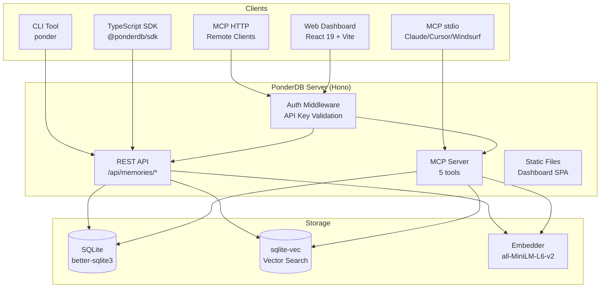

---

## 2. Current Architecture

### Tech Stack

| Layer | Technology | Details |
|-------|-----------|---------|
| Runtime | Node.js >= 22 | ES modules |
| API Server | Hono 4.x | Lightweight web framework |
| Database | SQLite + better-sqlite3 | Local-first, WAL mode |
| Vector DB | sqlite-vec 0.1.9 | KNN cosine search |
| Embeddings | Transformers.js + all-MiniLM-L6-v2 | 384-dim, local, ~80MB model |
| MCP | @modelcontextprotocol/sdk 1.12.1 | stdio + Streamable HTTP |
| Dashboard | React 19 + Vite 6.3.5 | Light theme SPA |
| CLI | Commander 13.1.0 | Terminal interface |
| Monorepo | npm workspaces | 6 packages |

### Monorepo Structure

```
packages/
  core/           → Types, interfaces, errors, utilities
  sqlite-store/   → StorageAdapter implementation (SQLite + sqlite-vec)
  server/         → Hono REST API + MCP server + embedders
  sdk/            → TypeScript client library
  cli/            → CLI tool (ponder command)
  dashboard/      → React SPA (served from server)
```

---

## 3. Package Dependency Graph

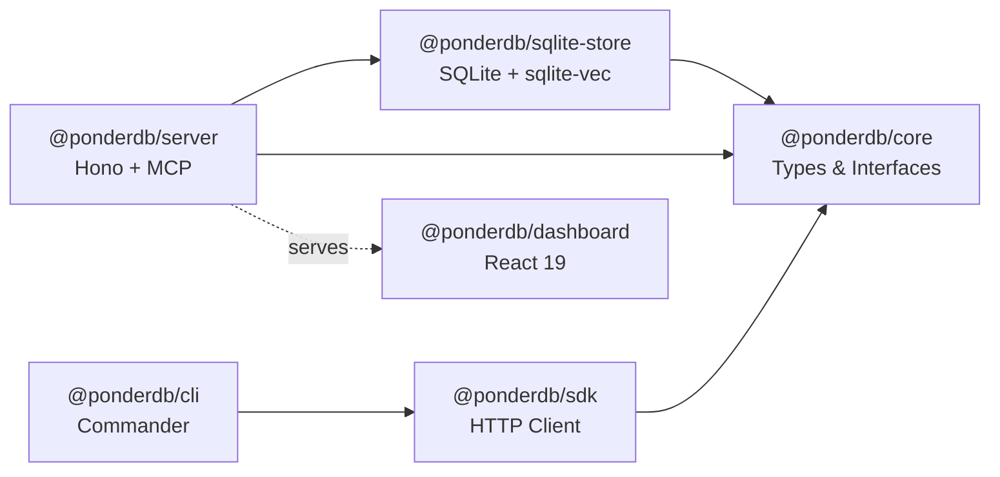

---

## 4. Data Flow Diagrams

### Memory Write Flow

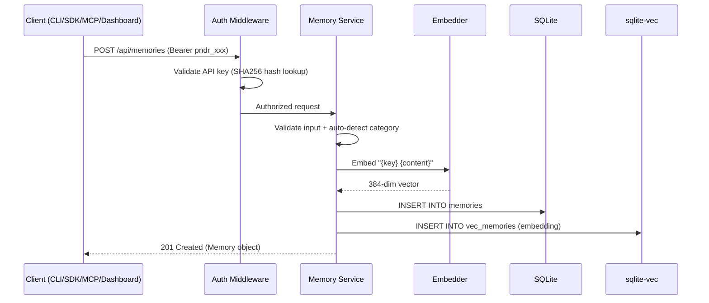

### Memory Search Flow (Hybrid)

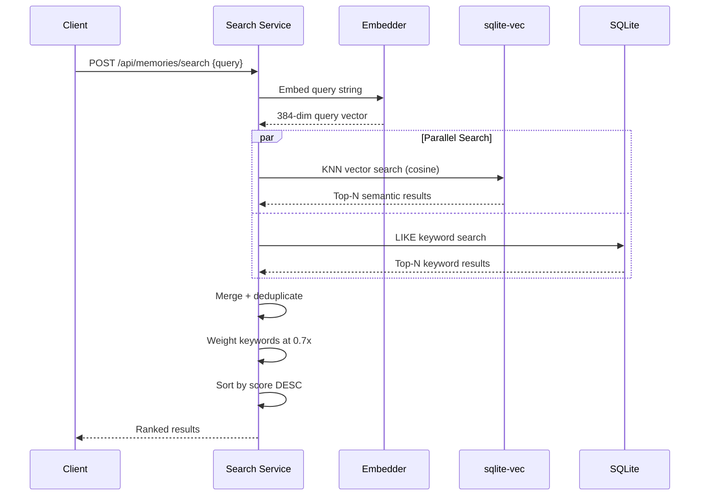

### MCP Tool Flow

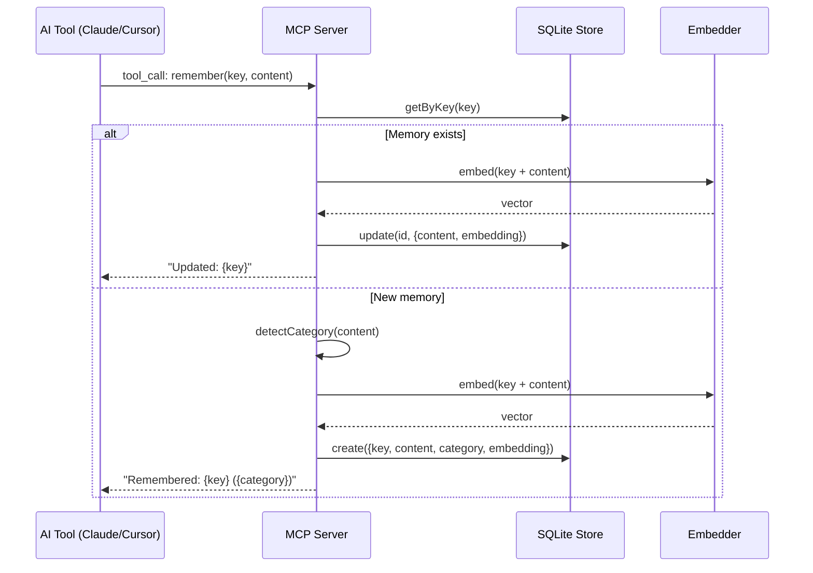

---

## 5. Database Schema

### Current Schema

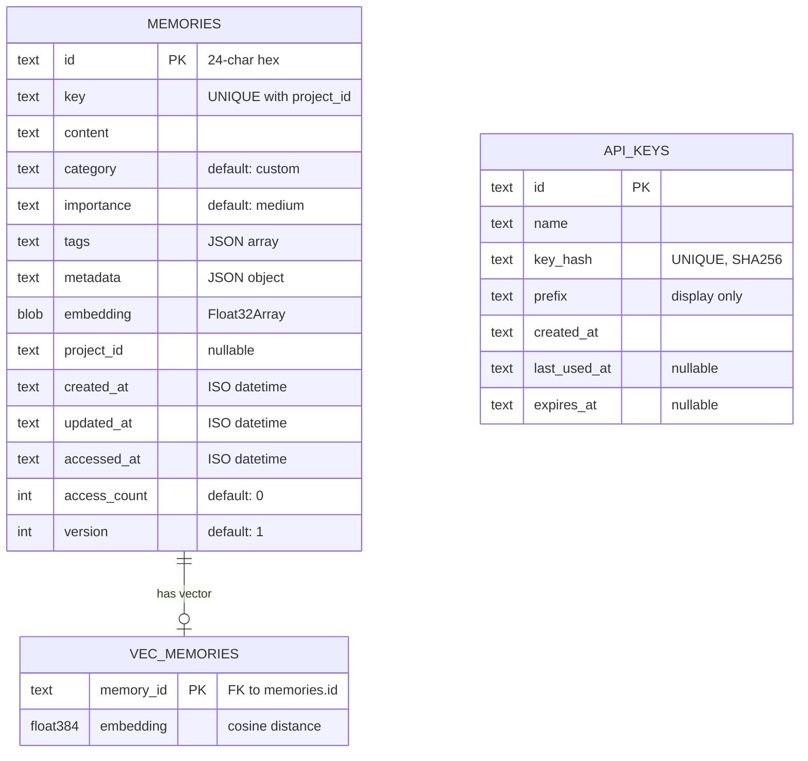

### Indexes

```sql
idx_memories_key         ON memories(key)
idx_memories_category    ON memories(category)
idx_memories_project_id  ON memories(project_id)
idx_memories_updated_at  ON memories(updated_at)
UNIQUE(key, project_id)  -- composite unique constraint
```

---

## 6. API & MCP Architecture

### REST API Endpoints

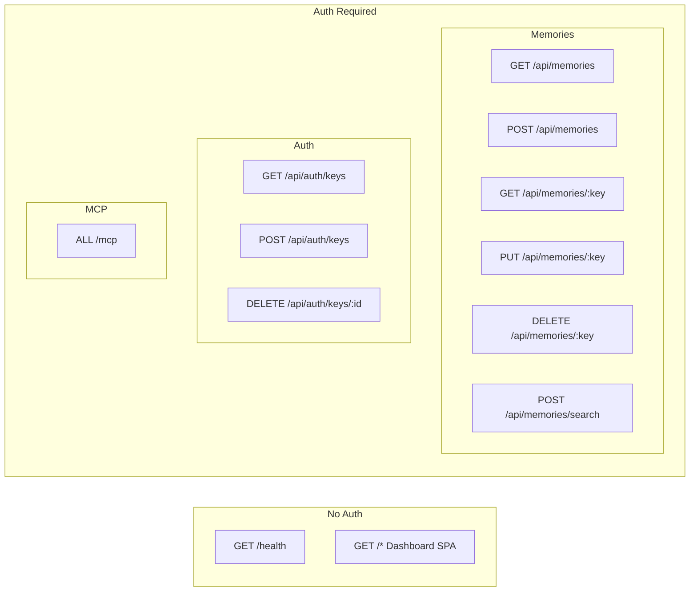

### MCP Tools

| Tool | Description | Params |
|------|-------------|--------|
| `remember` | Store/update memory (upsert) | key, content, category?, importance?, tags?, projectId? |
| `recall` | Get memory by key | key, projectId? |
| `search_memories` | Hybrid semantic + keyword search | query, category?, limit?, projectId? |
| `forget` | Delete memory | key, projectId? |
| `list_memories` | List recent memories | category?, limit?, projectId? |

### MCP Transports

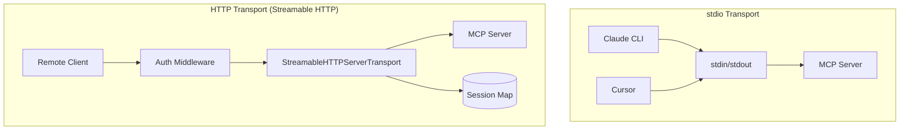

---

## 7. Authentication & Project Scoping

### Current Auth Flow

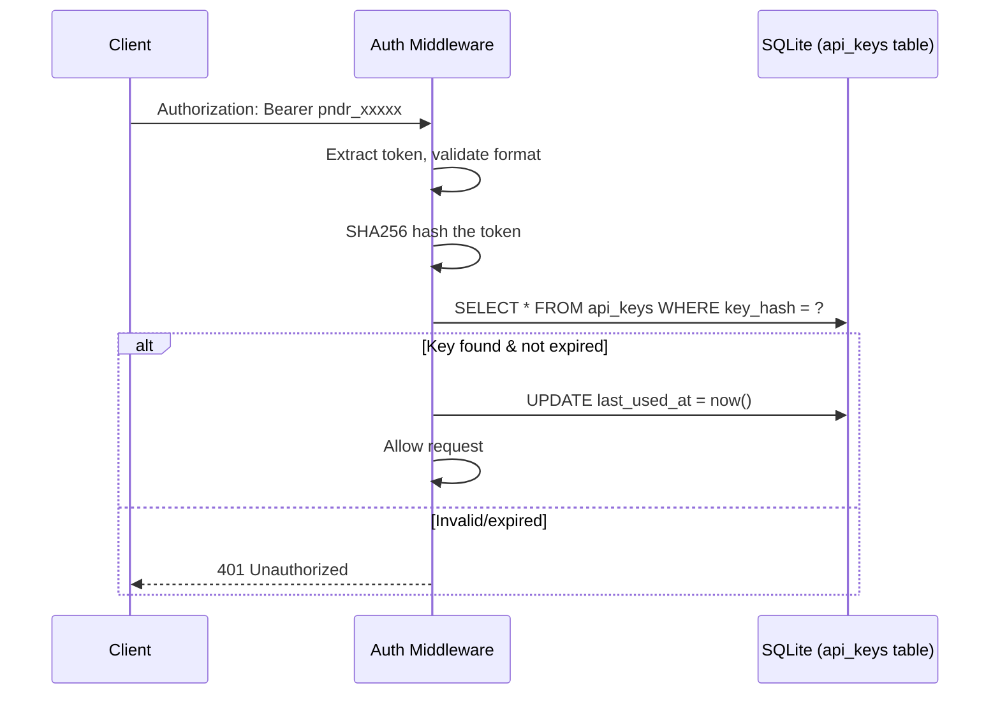

### API Key Format

```
pndr_<24-byte-random-base64url>
Example: pndr_g9Bo-qAXzzmyP-pHDCQb6uswG7vMWRtk

Storage: SHA256 hash in DB (never stored plaintext)
Display: prefix (first 12 chars) for identification
```

### Project Scoping (Current)

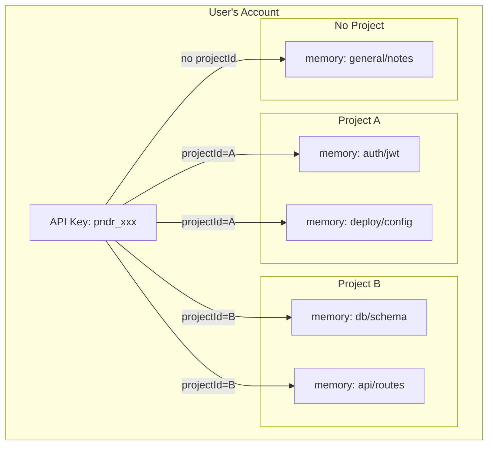

**How it works:**
- API key authenticates the user
- `projectId` parameter scopes memories to a project
- `UNIQUE(key, project_id)` allows same key name in different projects
- SDK/MCP pass `projectId` with every operation
- Dashboard has project selector that filters all views

---

## 8. Dashboard Architecture

### Current Dashboard

```mermaid
graph TB
    subgraph "App State (React useState)"
        VIEW[view: dashboard/memories/categories/keys]
        APIKEY[apiKey: localStorage]
        PROJECT[projectId: localStorage]
        MEMORY[selectedMemory: Memory | null]
    end

    subgraph "Views"
        D[Dashboard<br/>Stats + Charts + MiniTables]
        M[MemoryList<br/>Paginated Table + Detail]
        C[Categories<br/>Grid + Drill-down]
        K[ApiKeys<br/>Create + Revoke]
    end

    subgraph "Sidebar"
        NAV[Navigation]
        PROJ_SEL[Project Selector]
        KEY_INPUT[API Key Input]
    end

    subgraph "Top Bar"
        PROJ_BADGE[Current Project Badge]
    end

    VIEW --> D
    VIEW --> M
    VIEW --> C
    VIEW --> K
    PROJECT --> D
    PROJECT --> M
    PROJECT --> C
    APIKEY --> D
    APIKEY --> M
    APIKEY --> C
    APIKEY --> K
```

### Dashboard Features

| View | Features |
|------|----------|
| **Dashboard** | Animated stat cards (count-up), bar charts (categories, tags), importance grid, mini-tables (recent, most accessed, high priority), clickable memory links |
| **Memories** | Paginated table, category filter, text search, click-to-detail, delete with confirm |
| **Categories** | Grid of 10 categories with counts, drill-down table, clickable rows |
| **API Keys** | Create key, show once + copy, list with prefix, revoke |

---

## 9. Planned: Dynamic Categories

### Problem

Currently categories are hardcoded as an enum:
```
architecture | bug | pattern | config | decision | snippet | debug | workflow | dependency | custom
```

Users can't create custom categories, and AI can't generate new ones.

### Planned Architecture

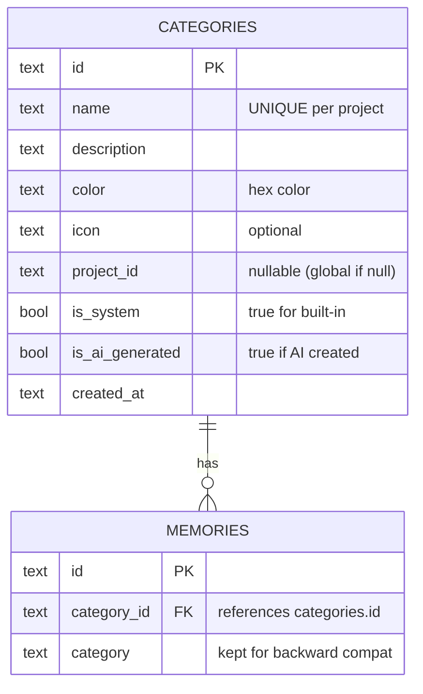

### How Dynamic Categories Work

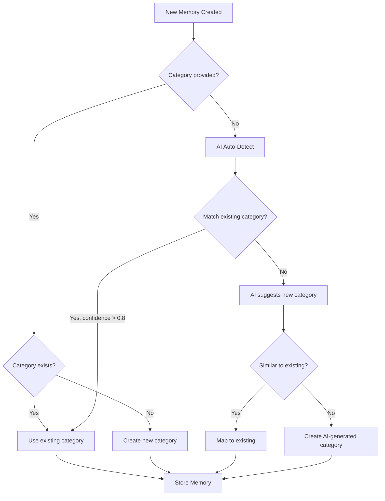

### Category API (Planned)

```
GET    /api/categories                 List all categories
POST   /api/categories                 Create custom category
PUT    /api/categories/:id             Update category
DELETE /api/categories/:id             Delete category (reassign memories)
POST   /api/categories/suggest         AI suggests category for content
```

### MCP Tool Enhancement

```typescript
// New MCP tool
server.tool("list_categories", "List all memory categories with counts", {
  projectId: z.string().optional(),
}, async ({ projectId }) => {
  const categories = await store.listCategories(projectId);
  // Returns: [{name, description, count, isSystem, isAiGenerated}]
});
```

---

## 10. Planned: Enhanced Project System

### Current vs Planned

| Feature | Current | Planned |
|---------|---------|---------|
| Project creation | Implicit (any string) | Explicit (API + Dashboard) |
| Project metadata | None | Name, description, created_at |
| Project listing | Extracted from memories | Dedicated API endpoint |
| Project deletion | N/A | Cascade delete memories |
| Project categories | Global only | Per-project categories |
| Project settings | None | Custom embedder, search config |

### Planned Project Architecture

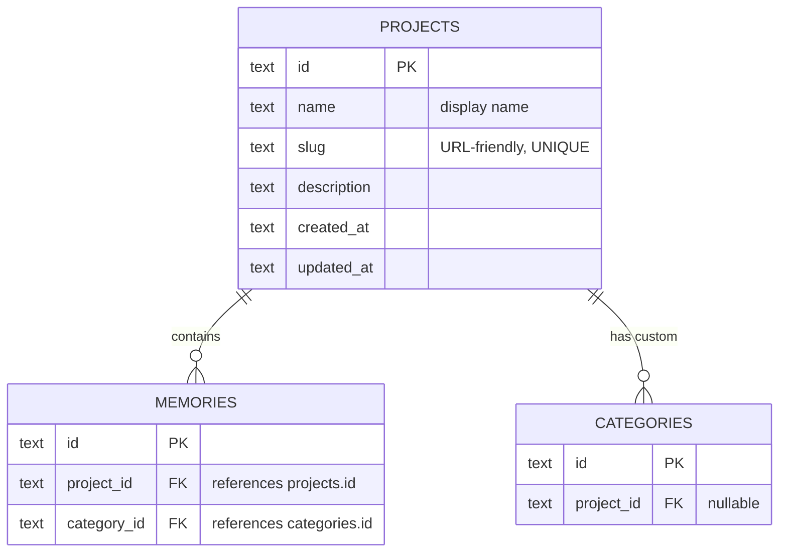

### Project API (Planned)

```
GET    /api/projects                   List all projects
POST   /api/projects                   Create project
GET    /api/projects/:id               Get project details
PUT    /api/projects/:id               Update project
DELETE /api/projects/:id               Delete project + memories
GET    /api/projects/:id/stats         Project statistics
```

### SDK Usage (Planned)

```typescript
import { PonderClient } from '@ponderdb/sdk';

const client = new PonderClient({
  baseUrl: 'http://127.0.0.1:7437',
  apiKey: 'pndr_xxx',
  projectId: 'my-project',  // Scopes all operations
});

// All operations scoped to project
await client.remember({ key: 'auth/jwt', content: '...' });
const mem = await client.recall('auth/jwt');
```

### MCP Config (Planned)

```json
{
  "mcpServers": {
    "ponderdb": {
      "command": "npx",
      "args": ["ponderdb-server", "mcp"],
      "env": {
        "PONDER_API_KEY": "pndr_xxx",
        "PONDER_PROJECT_ID": "my-project"
      }
    }
  }
}
```

---

## 11. Implementation Roadmap

### Phase 1: Core Improvements (Current Sprint)

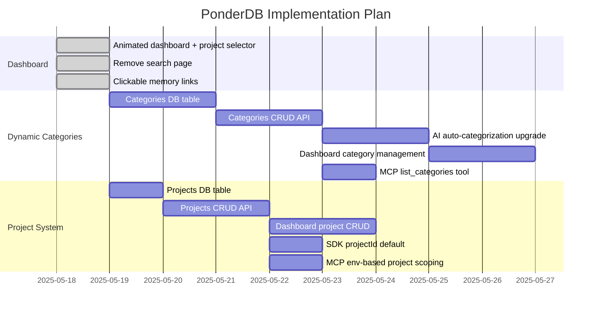

### Phase 2: Enhanced Features

- Memory versioning (history, diff, restore)
- Import/export (CLAUDE.md, .cursorrules, JSON)
- Stale memory detection
- Deduplication
- Memory quality/confidence scores

### Phase 3: Scale & Distribution

- PostgreSQL adapter (cloud mode)
- Cloud sync (local → cloud)
- Team/shared memories
- Multi-user auth (OAuth)

---

## Embedding Architecture

### Current

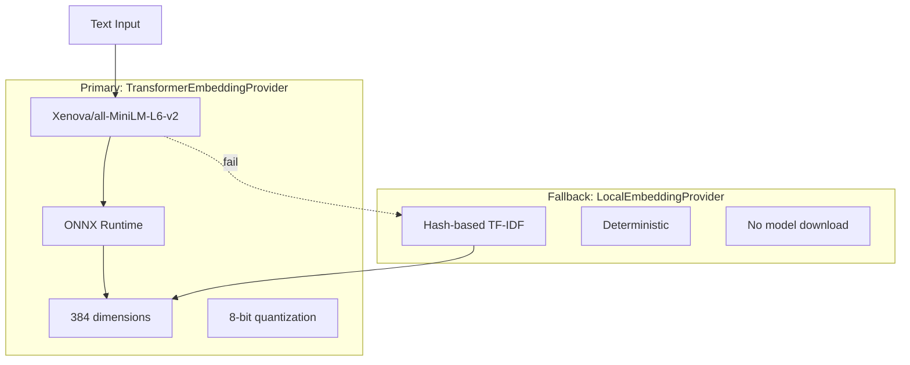

### Search Quality

| Search Type | Method | Score Weight | Best For |
|-------------|--------|-------------|----------|
| Semantic | sqlite-vec KNN (cosine) | 1.0x | Conceptual similarity |
| Keyword | SQLite LIKE on content+key | 0.7x | Exact phrases |
| Hybrid | Merge + deduplicate + sort | Combined | Default (best results) |

---

## Security Architecture

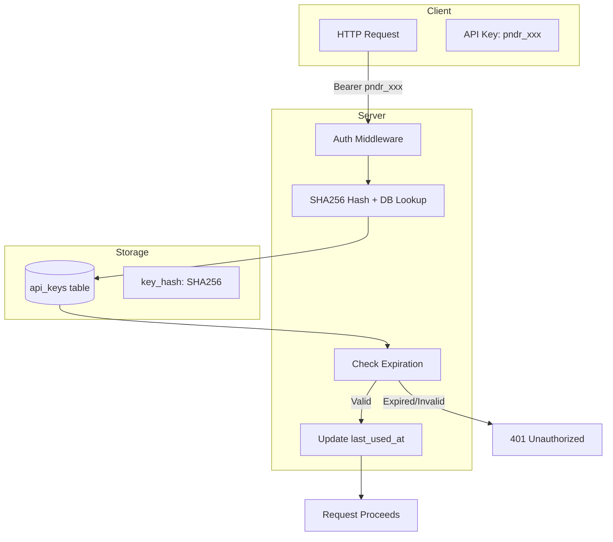

**Key Security Properties:**
- Keys never stored in plaintext (SHA256 hashed)
- Key format: `pndr_` prefix for easy identification
- Auto-generated on first server start
- Printed once to console (user must save)
- `last_used_at` tracking for audit
- Optional expiration support
